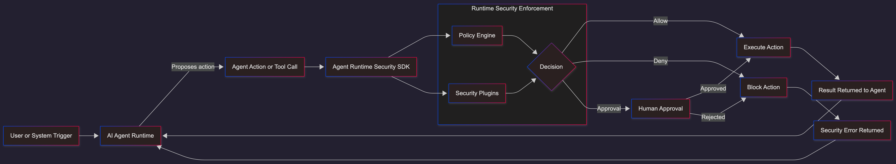

# Agent-SPM: Agent Security Posture Management

**Open-source platform for runtime security of AI agents.**

Protect AI agents with declarative security policies, identity management, data loss prevention, supply chain verification, anomaly detection, and compliance reporting. Runs in-process — no gateway, no infrastructure.

## Why Agent-SPM?

AI agents can access sensitive data, make API calls, and execute actions on your behalf. Without runtime security, a prompt injection or rogue agent could:

- Export your entire customer database
- Send PII/PCI data to external systems
- Execute unauthorized financial transactions
- Install compromised tools or run dangerous commands
- Escalate privileges through agent delegation chains

Agent-SPM gives you **security policies as code** enforced at runtime, right where your agent executes.

## Platform Overview

| Package | Description |
|---------|-------------|
| [`@agent-security/core`](#core-policy-engine) | Policy engine, plugin pipeline, audit logging |
| [`@agent-security/identity`](#identity--authorization) | Agent/tool registration, trust evaluation |
| [`@agent-security/egress`](#egress-control--dlp) | Data loss prevention, egress channel control |
| [`@agent-security/supply-chain`](#supply-chain-security) | MCP scanning, tool provenance, command governance |
| [`@agent-security/guardian`](#guardian-agents) | Anomaly detection, auto-kill, incident response |
| [`@agent-security/posture`](#posture-management) | Risk scoring, compliance mapping, SIEM integration |
| [`@agent-security/containment`](#containment) | Sandbox enforcement, change control |
| [`@agent-security/adapters`](#framework-adapters) | Cursor, Claude Code, LangChain, CrewAI |

Install only what you need. All packages compose through the core plugin pipeline.

## Quick Start

### 1. Install

```bash
npm install @agent-security/core
```

### 2. Create a Policy

Create `policy.json`:

```json
{
  "version": "0.1.0",
  "generated_at": "2026-01-29T00:00:00.000Z",
  "expires_at": "2027-01-29T00:00:00.000Z",
  "rules": [
    {
      "id": "DENY_BULK_EXPORT",
      "description": "Block bulk data exports",
      "match": { "tool_name": "query_database", "environment": "*" },
      "when": { "contains_any": ["SELECT *", "export", "dump"] },
      "outcome": "DENY"
    },
    {
      "id": "REQUIRE_APPROVAL_PAYMENT",
      "description": "Payments need approval in production",
      "match": { "tool_name": "trigger_payment", "environment": "prod" },
      "outcome": "REQUIRE_APPROVAL",
      "approver_role": "finance_manager"
    }
  ],
  "defaults": { "outcome": "ALLOW" }
}
```

### 3. Integrate with Your Agent

```typescript
import { AgentSecurity, killSwitch, rateLimiter } from '@agent-security/core';

const ks = killSwitch();

const security = new AgentSecurity({
  policyPath: './policy.json',
  plugins: [ks, rateLimiter({ maxPerMinute: 60 })],
  approvalTimeoutMs: 300_000,

  onApprovalRequired: async (request, decision) => {
    return await askManager(request);
  },
  onDeny: (request, decision) => {
    logger.error('Action blocked', { request, decision });
  },
});

const result = await security.checkToolCall({
  toolName: 'send_email',
  toolArgs: { to: 'user@example.com' },
  agentId: 'my-agent',
  environment: 'prod',
});

if (result.allowed) {
  await sendEmail();
}

// Emergency: disable a rogue agent instantly
ks.kill('rogue-agent-001', 'Suspicious bulk export pattern');
```

### 4. Or Use the Protect Wrapper

```typescript
const sendEmail = security.protect(
  'send_email',
  async (to: string, subject: string, body: string) => {
    return await emailService.send({ to, subject, body });
  },
  {
    agentId: 'email-agent',
    environment: 'prod',
    extractToolArgs: (to, subject, body) => ({ to, subject, body }),
  }
);

await sendEmail('user@example.com', 'Hello', 'World');
```

## Core Policy Engine

The 5-phase plugin pipeline at the heart of Agent-SPM:

```
Phase 1: beforeCheck    → Kill switch, rate limiting, identity, DLP, supply chain, containment
Phase 2: evaluate       → Core policy engine (first-match rule processing)
Phase 3: afterDecision  → Modify decisions, apply overrides
Phase 4: callbacks      → onAllow / onDeny / onApprovalRequired / onStepUp / onTicket / onHuman
Phase 5: afterExecution → Output validation (protect() only)
```

**Built-in plugins:**

- **Kill Switch** — `ks.kill('agent-id')` / `ks.killAll()` / `ks.revive('agent-id')`
- **Rate Limiter** — `rateLimiter({ maxPerMinute: 60, maxPerMinutePerTool: 20 })`
- **Session Context** — Per-session tool usage tracking with configurable TTL
- **Output Validator** — Post-execution regex scanning for sensitive data

**6 decision types:** ALLOW, DENY, REQUIRE_APPROVAL, STEP_UP, REQUIRE_TICKET, REQUIRE_HUMAN

## Identity & Authorization

`npm install @agent-security/identity`

Register agents with trust levels and enforce identity requirements:

```typescript
import { AgentRegistry, TrustEvaluator, identityEnforcer } from '@agent-security/identity';

const registry = new AgentRegistry();
registry.register({
  agent_id: 'finance-bot',
  name: 'Finance Bot',
  trust_level: 'privileged',
  roles: ['finance.reader', 'finance.writer'],
  agent_type: 'workflow_agent',
});

const plugin = identityEnforcer({
  agentRegistry: registry,
  trustEvaluator: new TrustEvaluator(),
  requireRegistration: true,
  minimumTrustLevel: 'basic',
});
```

**Trust hierarchy:** untrusted → basic → verified → privileged → system

## Egress Control & DLP

`npm install @agent-security/egress`

Classify data in tool arguments and block sensitive data from leaving through unauthorized channels:

```typescript
import { egressEnforcer, DEFAULT_CLASSIFIERS } from '@agent-security/egress';

const egress = egressEnforcer({
  policy: {
    rules: [
      { id: 'BLOCK_PII_EMAIL', description: 'No PII via email', classifications: ['PII'], channels: ['email'], action: 'block' },
      { id: 'BLOCK_SECRETS', description: 'No secrets anywhere', classifications: ['SECRET'], action: 'block' },
    ],
    default_action: 'allow',
  },
  classifiers: DEFAULT_CLASSIFIERS,
  toolChannelMappings: [
    { tool_name: 'send_email', channel: 'email', destination_field: 'to' },
  ],
});
```

**Built-in classifiers:** SSN, email, phone, credit cards, API keys, AWS keys, private keys, generic secrets

## Supply Chain Security

`npm install @agent-security/supply-chain`

Verify tool provenance, scan MCP servers, and govern shell commands:

```typescript
import { McpScanner, supplyChainGuard, ToolProvenance, CommandGovernor } from '@agent-security/supply-chain';

// Scan MCP servers for risks
const scanner = new McpScanner();
const report = scanner.scan({ name: 'external-server', permissions: ['network.outbound'], tools: [...] });

// Govern shell commands
const governor = new CommandGovernor({
  rules: [
    { pattern: 'npm test', action: 'allow', reason: 'Tests are safe' },
    { pattern: 'rm -rf *', action: 'block', reason: 'Destructive operations blocked' },
  ],
  default_action: 'block',
});
```

## Guardian Agents

`npm install @agent-security/guardian`

Autonomous anomaly detection and incident response:

```typescript
import { GuardianAgent, BLUEPRINT_FINANCE } from '@agent-security/guardian';

const guardian = new GuardianAgent({
  ...BLUEPRINT_FINANCE,
  auto_kill_threshold: 3,
  onAnomaly: (incident) => alertSecurityTeam(incident),
  onKill: (agentId, reason) => console.log(`Terminated: ${agentId}`),
});

// Feed audit events from the core SDK
const security = new AgentSecurity({
  policyBundle,
  onAuditEvent: (event) => guardian.processEvent(event),
});
```

**Anomaly types:** frequency spikes, volume spikes, suspicious sequences, off-hours activity

## Posture Management

`npm install @agent-security/posture`

Fleet-wide risk scoring, compliance mapping, and SIEM integration:

```typescript
import { RiskScorer, ComplianceMapper, SocFormatter } from '@agent-security/posture';

// Risk scoring
const scorer = new RiskScorer();
const fleetScore = scorer.scoreFleet(inventory.getAll());

// Compliance reports
const mapper = new ComplianceMapper();
const report = mapper.generateReport('eu_ai_act', { hasInventory: true, hasAuditLog: true, ... });

// SIEM export
const formatter = new SocFormatter();
const cef = formatter.toCef(auditEvent);  // Splunk, QRadar
```

**Frameworks:** EU AI Act, UK AI Governance

## Containment

`npm install @agent-security/containment`

Sandbox enforcement and change control:

```typescript
import { SandboxManager, ChangeControl, containmentPlugin } from '@agent-security/containment';

const sandbox = new SandboxManager();
sandbox.registerSandbox('terminal', {
  type: 'process',
  allowed_paths: ['/tmp', '/home/app'],
  network_enabled: false,
  timeout_ms: 10000,
});

const changeControl = new ChangeControl({
  provider: 'jira',
  ticket_pattern: '^(JIRA|OPS)-\\d+$',
  required_statuses: ['approved', 'in_progress'],
  validateTicket: async (ticketId) => fetchTicket(ticketId),
});
```

## Framework Adapters

`npm install @agent-security/adapters`

Pre-built integrations for popular AI frameworks:

```typescript
import { createCursorMiddleware, createClaudeCodeWrapper, wrapLangChainTool, createCrewAIGuard } from '@agent-security/adapters';

// Cursor IDE
const middleware = createCursorMiddleware(security, { agentId: 'cursor-agent', environment: 'dev' });

// Claude Code
const guard = createClaudeCodeWrapper(security, { agentId: 'claude-code', environment: 'dev' });

// LangChain
const secureTool = wrapLangChainTool(security, 'query_db', queryFn, { agentId: 'lc-agent' });

// CrewAI
const crewGuard = createCrewAIGuard(security, { agentId: 'crew-agent', environment: 'prod' });
```

## Advanced Policy Rules

**Match multiple tools:**
```json
{ "match": { "tool_name": ["trigger_payment", "trigger_refund"], "environment": "prod" } }
```

**Glob prefix matching:**
```json
{ "match": { "tool_name": "query_*", "environment": "*" } }
```

**Regex matching:**
```json
{ "when": { "matches_regex": "^SELECT\\s+\\*" } }
```

**Numeric comparisons on tool args:**
```json
{ "when": { "tool_args_match": { "amount": { "gt": 1000 } } } }
```

**Identity-aware rules:**
```json
{ "match": { "tool_name": "trigger_payment", "trust_level_min": "privileged", "agent_roles_any": ["finance.writer"] } }
```

## Run the Demos

```bash
git clone https://github.com/mlnas/agent-runtime-security
cd agent-runtime-security

npm install
npm run demo               # Core demo (9 scenarios)
npm run demo:quick         # Quick demo (5 scenarios)
npm run demo:identity      # Identity & authorization
npm run demo:egress        # DLP & egress control
npm run demo:supply-chain  # Supply chain security
npm run demo:guardian       # Guardian & posture management
npm run demo:full-spm       # All packages end-to-end
```

## API Reference

### AgentSecurity Constructor

| Option | Type | Description |
|---|---|---|
| `policyPath` | `string` | Path to policy JSON file |
| `policyJson` | `string` | Policy as JSON string |
| `policyBundle` | `PolicyBundle` | Policy object |
| `policyLoader` | `() => Promise<PolicyBundle>` | Async loader (call `init()` after) |
| `plugins` | `SecurityPlugin[]` | Array of plugins |
| `approvalTimeoutMs` | `number` | Timeout for approval callbacks |
| `onApprovalRequired` | `(req, dec) => Promise<boolean>` | Approval callback |
| `onDeny` | `(req, dec) => void` | Denial callback |
| `onAllow` | `(req, dec) => void` | Allow callback |
| `onAuditEvent` | `(event) => void` | Audit callback |
| `onError` | `(error, ctx) => void` | Error callback |
| `defaultEnvironment` | `string` | Default environment |
| `defaultOwner` | `string` | Default agent owner |

### Methods

| Method | Description |
|---|---|
| `checkToolCall(params)` | Check if a tool call is allowed |
| `protect(toolName, fn, opts)` | Wrap a function with security |
| `init()` | Async init (for policyLoader) |
| `registerPlugin(plugin)` | Add a plugin at runtime |
| `unregisterPlugin(name)` | Remove a plugin |
| `getPlugin(name)` | Get a registered plugin |
| `getAuditLog()` | Get all audit events |
| `clearAuditLog()` | Clear audit history |
| `getPolicyBundle()` | Get current policy |
| `reloadPolicy()` | Reload from file/JSON |
| `reloadPolicyAsync(loader?)` | Reload from async source |
| `shutdown()` | Gracefully shut down SDK + plugins |

## Documentation

- [Quick Start Guide](./QUICKSTART.md)
- [Architecture](./docs/architecture.md) — System design, pipeline, threat model
- [Package Reference](./docs/packages.md) — Full API for all 8 packages
- [Schema Specification](./docs/schemas.md) — Type definitions (v0.2)
- [Policy Guide](./docs/policies.md) — Policy authoring in depth
- [Compliance](./docs/compliance.md) — EU AI Act and UK AI Governance mapping
- [Security](./SECURITY.md) — Security properties and hardening
- [Examples](./examples/) — Integration demos and learning progression

## Contributing

We welcome contributions! This is an open-source project designed for the community.

## License

MIT License - see [LICENSE](./LICENSE) for details.

---

**Built for enterprises integrating AI agents into production systems.**
