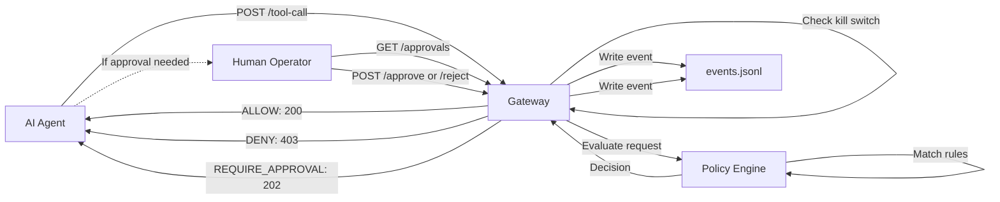

# Architecture (v0.1)

## Goal
Enforce runtime policies for AI agent tool calls with allow/deny/approval decisions, plus audit trails.

## Components
### core (shared engine)
- Loads a PolicyBundle
- Evaluates AgentActionRequest -> Decision
- Emits Event objects (redacted)

No HTTP servers, no databases, no UI.

### gateway (enforcement runtime)
- Receives tool-call requests (HTTP proxy style)
- Calls core evaluator
- Enforces Decision:
  - ALLOW: forward to tool
  - DENY: block
  - REQUIRE_APPROVAL: pause, await approval, then allow/deny
- Writes append-only audit log (local JSONL for demo)

### control-plane (later)
- Policy management UI + API
- Event viewer
- Policy bundle signing and distribution

### sdk (later)
- Developer wrapper for agent frameworks
- Uses same core evaluator + local policy bundles

## System Flow

The system follows a simple request/response flow:

1. **AI Agent** sends a tool call request to the **Gateway**
2. **Gateway** checks if the agent is disabled (kill switch)
3. **Gateway** sends the request to the **Policy Engine** (core) for evaluation
4. **Policy Engine** matches the request against policy rules and returns a **Decision**
5. **Gateway** writes an event to the audit log (`events.jsonl`)
6. **Gateway** responds to the agent based on the decision type

## Decision Types

The policy engine returns one of three outcomes:

**ALLOW (200)**
- The tool call is permitted
- Gateway returns success response
- Agent can proceed with the action
- Default for dev/staging environments

**DENY (403)**
- The tool call is blocked
- Gateway returns forbidden response
- Agent cannot proceed
- Used for dangerous operations (e.g., bulk exports, sensitive data leaks)

**REQUIRE_APPROVAL (202)**
- The tool call needs human review
- Gateway creates an approval request and returns pending response
- Agent must wait for operator decision
- Used for high-risk production operations (e.g., payments, emails)

## Approval Process

When a decision requires approval:

1. Gateway creates an approval request with status `PENDING`
2. Human operator retrieves pending approvals: `GET /approvals`
3. Operator reviews the request and decides:
   - **Approve**: `POST /approvals/:id/approve` → Tool executes (mocked in demo) → Returns result
   - **Reject**: `POST /approvals/:id/reject` → Tool does not execute → Returns rejection reason
4. Every approval decision (APPROVED/REJECTED) is logged to the audit trail

This provides human-in-the-loop control for sensitive operations while maintaining a complete audit history.

## Non-goals for v0.1
- full multi-tenant auth
- billing
- full SIEM integrations
