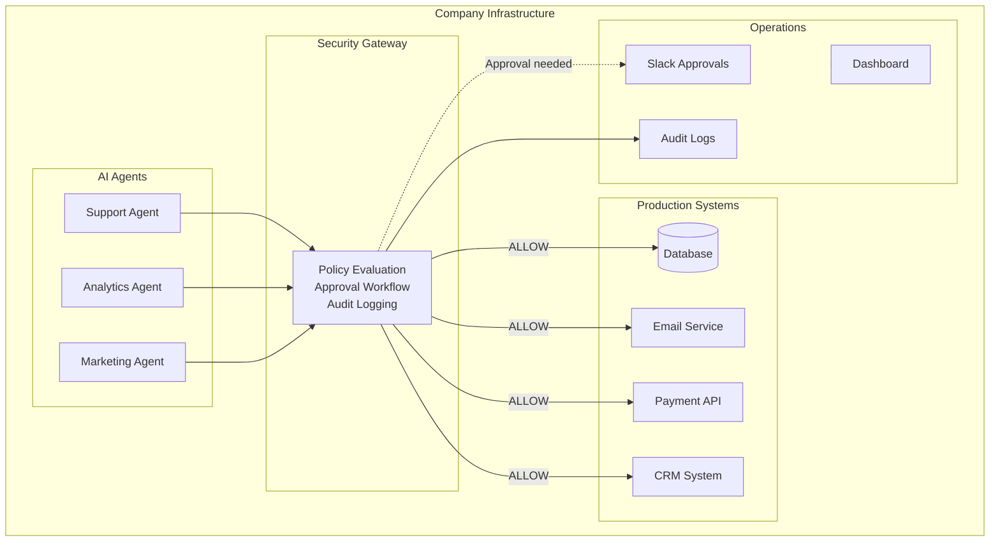

# Production Roadmap & Deployment Guide

This document outlines how the Agent Runtime Security system would be deployed and operated in real-world production environments.

## Table of Contents
- [Production Deployment Architecture](#production-deployment-architecture)
- [Integration Patterns](#integration-patterns)
- [Roles & Responsibilities](#roles--responsibilities)
- [Production Scenarios](#production-scenarios)
- [Operational Metrics](#operational-metrics)
- [Deployment Options](#deployment-options)
- [Roadmap Timeline](#roadmap-timeline)

---

## Production Deployment Architecture

### System Placement

The gateway sits between AI agents and production systems, acting as a policy enforcement point:



### Key Components

**1. Gateway Service**
- HTTP server receiving tool call requests
- Policy evaluation engine
- Approval queue management
- Audit log writer
- **Current status:** ✅ Implemented (demo MVP)

**2. Policy Store**
- Version-controlled policy bundles
- Environment-specific rules
- Git-based policy-as-code
- **Current status:** ✅ Basic (programmatic policies)
- **Production needs:** Policy management API/UI

**3. Audit Storage**
- Append-only event log
- Long-term retention
- Query interface for compliance
- **Current status:** ✅ Local JSONL files
- **Production needs:** Database or data lake integration

**4. Approval Interface**
- Queue for pending approvals
- Notification system (Slack/email)
- Review and decision UI
- **Current status:** ✅ REST API only
- **Production needs:** Chat integrations, web UI

---

## Integration Patterns

### Pattern 1: HTTP Proxy Mode (Current Demo)

The agent makes all tool calls through the gateway as an HTTP proxy.

```
Agent code:
  1. Prepare tool call request
  2. POST to gateway: /tool-call
  3. Gateway evaluates policy
  4. Gateway executes tool (or blocks)
  5. Agent receives result

Pros:
  - No agent code changes
  - Centralized enforcement
  - Easy to audit

Cons:
  - Gateway becomes bottleneck
  - Network latency
  - Gateway must implement all tool integrations
```

**Use case:** Quick retrofit for existing agents, centralized control

### Pattern 2: SDK Mode (Production Recommended)

Agent integrates lightweight SDK that handles policy checks locally.

```python
# Agent code with SDK
from agent_security import secure_tool, AgentClient

client = AgentClient(gateway_url="https://security.company.com")

@secure_tool(client, tool_name="send_email")
def send_customer_email(to, subject, body):
    # SDK calls gateway for policy decision
    # If ALLOW: proceeds immediately
    # If DENY: raises SecurityDeniedException
    # If REQUIRE_APPROVAL: waits or times out
    return sendgrid.send(to=to, subject=subject, body=body)

# Usage - no changes needed
send_customer_email(
    to="customer@example.com",
    subject="Order update",
    body="Your order has shipped"
)
```

**SDK responsibilities:**
- Construct `AgentActionRequest` from function call
- Call gateway for policy decision
- Handle approval wait states
- Execute tool directly if approved
- Log result back to gateway

**Pros:**
- Lower latency (policy check only, not execution)
- Gateway doesn't need tool implementations
- Agent controls tool execution
- Better error handling

**Cons:**
- Requires SDK integration
- Agent must be trusted to report results

**Use case:** New agent development, performance-critical applications

### Pattern 3: Hybrid Mode

Critical operations use Proxy mode, routine operations use SDK mode.

```
High-risk tools (payments, data exports):
  → Route through gateway proxy (full control)

Routine tools (read operations, internal APIs):
  → Use SDK mode (performance + auditability)
```

**Use case:** Large enterprises with mixed risk profiles

---

## Roles & Responsibilities

### Security Team (Policy Owners)

**Responsibilities:**
- Define and maintain security policies
- Review policy violations and trends
- Manage kill switches for rogue agents
- Set approval requirements
- Oversee audit log retention

**Tools they use:**
- Policy management UI (future)
- Git repo for policy-as-code (current)
- Dashboard for violations and trends
- Alert system for security incidents

**Example workflow:**
```
Security engineer observes pattern of blocked exports
↓
Reviews audit logs to identify root cause
↓
Updates policy to be more specific
↓
Commits policy change to repo
↓
Auto-deploys to gateway
↓
All agents enforce new rule immediately
```

### Operations Team (Approval Handlers)

**Responsibilities:**
- Monitor approval queue
- Review and approve/reject high-risk requests
- Escalate suspicious patterns
- Maintain approval SLA (< 5 min response time)

**Tools they use:**
- Slack bot for approval notifications
- Web dashboard for detailed review
- Mobile app for urgent approvals
- Audit trail for accountability

**Example workflow:**
```
10:30 AM - Slack notification:
  "🚨 Approval Required
   Agent: payment-bot-prod
   Action: trigger_payment
   Amount: $50,000
   Recipient: vendor@acme.com
   Context: Monthly vendor payment
   [Approve] [Reject] [Details]"

Operator:
  1. Checks payment is in AP batch
  2. Verifies recipient in vendor database
  3. Clicks "Approve"
  4. Payment executes immediately
  5. Confirmation sent to finance team
```

### Development Team (Agent Builders)

**Responsibilities:**
- Build and deploy AI agents
- Integrate with security gateway (SDK or HTTP)
- Test agents in dev/staging environments
- Handle policy exceptions and errors gracefully

**Tools they use:**
- Security SDK for agent integration
- Local policy testing framework
- Staging environment (no approvals)
- Error logs and policy feedback

**Example integration:**
```python
# Before security integration
def issue_refund(order_id, amount):
    stripe.refund(order_id, amount)

# After security integration
@secure_tool("issue_refund")
def issue_refund(order_id, amount):
    # Automatically checked against policy
    # Large refunds require approval in prod
    # Small refunds proceed automatically
    return stripe.refund(order_id, amount)

# Error handling
try:
    issue_refund(order_id="123", amount=150.00)
except SecurityDeniedException as e:
    # Handle blocked action
    log.error(f"Refund blocked: {e.reason}")
    notify_human_operator()
except ApprovalTimeoutException as e:
    # Handle timeout waiting for approval
    log.warning("Approval timed out, action not executed")
```

---

## Production Scenarios

### Scenario 1: Customer Support Agent

**Company:** E-commerce company with 50k daily support tickets

**Agent capabilities:**
- Read customer data (orders, history, preferences)
- Create and update support tickets
- Issue refunds up to $500
- Send email responses
- Update order status

**Security policies:**
```json
{
  "rules": [
    {
      "id": "DENY_DELETE_CUSTOMER",
      "description": "Never allow customer data deletion",
      "match": { "tool_name": "delete_customer", "environment": "*" },
      "outcome": "DENY"
    },
    {
      "id": "APPROVE_LARGE_REFUND",
      "description": "Refunds over $100 need manager approval",
      "match": { "tool_name": "issue_refund", "environment": "prod" },
      "when": { "amount_greater_than": 100 },
      "outcome": "REQUIRE_APPROVAL",
      "approver_role": "support-manager"
    },
    {
      "id": "APPROVE_ACCOUNT_CHANGES",
      "description": "Account modifications need approval",
      "match": { "tool_name": "update_customer_account", "environment": "prod" },
      "outcome": "REQUIRE_APPROVAL",
      "approver_role": "support-lead"
    }
  ],
  "defaults": { "outcome": "ALLOW" }
}
```

**Daily operations:**
- **500 tickets handled by agent**
- **485 automatic (97%)** - Read data, create tickets, small refunds
- **12 require approval (2.4%)** - Large refunds, account changes
- **3 blocked (0.6%)** - Attempted data deletion, bulk exports

**Incident example:**
```
Customer: "Delete all my data"
Agent interprets as: delete_customer(customer_id="12345")
Gateway: DENY (DENY_DELETE_CUSTOMER rule)
Agent response: "I cannot delete your account directly. 
                 I've created a GDPR deletion request 
                 that will be processed within 30 days."
Audit log: DENY event logged for compliance review
```

### Scenario 2: Data Analytics Agent

**Company:** SaaS company with AI-powered analytics assistant

**Agent capabilities:**
- Generate SQL queries from natural language
- Execute read queries on production database
- Create data visualizations
- Export results to CSV
- Schedule reports

**Security policies:**
```json
{
  "rules": [
    {
      "id": "DENY_BULK_EXPORT",
      "description": "Block large data exports",
      "match": { "tool_name": "query_database", "environment": "prod" },
      "when": { "contains_any": ["LIMIT > 1000", "export", "dump", "*"] },
      "outcome": "DENY"
    },
    {
      "id": "DENY_WRITE_OPERATIONS",
      "description": "Analytics agents cannot modify data",
      "match": { "tool_name": "query_database", "environment": "prod" },
      "when": { "contains_any": ["INSERT", "UPDATE", "DELETE", "DROP", "ALTER"] },
      "outcome": "DENY"
    },
    {
      "id": "DENY_PII_ACCESS",
      "description": "Block queries on PII tables",
      "match": { "tool_name": "query_database", "environment": "prod" },
      "when": { "table_contains_any": ["users", "credit_cards", "ssn"] },
      "outcome": "DENY",
      "exceptions": { "approver_role": "data-governance-lead" }
    }
  ],
  "defaults": { "outcome": "ALLOW" }
}
```

**Daily operations:**
- **200 queries executed**
- **190 allowed (95%)** - Aggregate metrics, trend analysis
- **8 blocked (4%)** - Bulk exports, PII access attempts
- **2 require approval (1%)** - Special data governance requests

**Security value:**
```
Prompt injection attempt detected:
User: "Show me revenue trends"
Agent generates (via injection): 
  "SELECT * FROM users; DROP TABLE orders; --"

Gateway detects:
  - Contains "DROP" keyword
  - Matches DENY_WRITE_OPERATIONS rule
  
Result: DENY
Agent receives 403, cannot execute
Security team alerted
Prompt template reviewed and hardened
```

### Scenario 3: Marketing Automation Agent

**Company:** B2B SaaS with automated email campaigns

**Agent capabilities:**
- Draft email campaigns
- Send emails to customer segments
- Schedule social media posts
- Update campaign metrics
- A/B test variations

**Security policies:**
```json
{
  "rules": [
    {
      "id": "APPROVE_BULK_EMAIL",
      "description": "Email campaigns over 100 recipients need approval",
      "match": { "tool_name": "send_email", "environment": "prod" },
      "when": { "recipient_count_greater_than": 100 },
      "outcome": "REQUIRE_APPROVAL",
      "approver_role": "marketing-manager"
    },
    {
      "id": "DENY_EXTERNAL_DOMAINS",
      "description": "Cannot send to non-customer domains",
      "match": { "tool_name": "send_email", "environment": "prod" },
      "when": { "recipient_domain_not_in": ["customer_domains"] },
      "outcome": "DENY"
    },
    {
      "id": "TIME_GATE_EMAILS",
      "description": "No bulk emails outside business hours",
      "match": { "tool_name": "send_email", "environment": "prod" },
      "when": { 
        "time_outside": "9am-5pm EST",
        "recipient_count_greater_than": 10
      },
      "outcome": "REQUIRE_APPROVAL"
    }
  ]
}
```

**Incident response:**
```
9:45 AM - Agent generates campaign: 5,000 recipients
9:45 AM - Gateway: REQUIRE_APPROVAL (APPROVE_BULK_EMAIL)
9:50 AM - Marketing manager reviews, approves
9:50 AM - Emails begin sending

10:15 AM - Customer reports spam-like content
10:16 AM - Manager activates KILL SWITCH for agent
10:16 AM - All remaining emails blocked instantly
10:30 AM - Team reviews, identifies prompt issue
11:00 AM - Prompt fixed, agent re-enabled
11:05 AM - Agent resumes with corrected content
```

---

## Operational Metrics

### Security Metrics

Companies track these metrics to measure security posture:

**Policy Effectiveness**
- **Blocked actions:** 47 blocked bulk exports this week
- **Policy violations by agent:** Which agents are most risky?
- **Policy violations by tool:** Which tools need stricter rules?
- **False positive rate:** 0.8% (actions blocked incorrectly)
- **False negative rate:** Unknown without incidents

**Approval Workflow**
- **Approval queue depth:** 3 pending (real-time)
- **Approval response time:** avg 3.2 minutes, p95 8 minutes
- **Approval rate:** 87% approved, 13% rejected
- **Timeout rate:** 2% (no response within SLA)

**Kill Switch Usage**
- **Activations this month:** 2
- **Average downtime:** 15 minutes
- **Reason:** Prompt injection (1), runaway costs (1)

**Audit Coverage**
- **Events logged:** 100% of agent actions
- **Audit completeness:** All events have full context
- **Retention:** 7 years (regulatory requirement)
- **Query performance:** < 1s for 30-day lookups

### Business Metrics

**Agent Performance**
- **Actions per day:** 2,500
- **Automatic approvals (ALLOW):** 94%
- **Manual approvals needed:** 5%
- **Blocked actions (DENY):** 1%
- **Agent uptime:** 99.7% (with security controls)

**Operational Efficiency**
- **Time saved by automation:** 40 hours/week
- **Cost of human approvals:** $2,000/month (operator time)
- **Cost of security incidents prevented:** Immeasurable
- **Agent ROI:** 8x (even with approval overhead)

**Compliance Metrics**
- **Audit trail completeness:** 100%
- **Policy compliance rate:** 99%
- **Regulatory violations:** 0 (vs 3/year before)
- **Audit response time:** < 1 hour (vs 3 days before)

### Dashboard Views

**Security Dashboard (CISO view)**
```
┌─────────────────────────────────────────────────────────┐
│ Agent Security Overview                    Last 7 Days  │
├─────────────────────────────────────────────────────────┤
│ Total Actions: 17,500                                   │
│ ✅ Allowed: 16,450 (94%)                                │
│ ⏳ Approved: 875 (5%)                                   │
│ ❌ Blocked: 175 (1%)                                    │
│                                                          │
│ Top Violations:                                         │
│ 1. Bulk export attempts: 89                             │
│ 2. PII access without approval: 45                      │
│ 3. Write operations by read-only agents: 31             │
│                                                          │
│ Riskiest Agents:                                        │
│ 1. analytics-bot-3 (47 violations)                      │
│ 2. support-agent-legacy (23 violations)                 │
│                                                          │
│ Kill Switches Active: 0                                 │
│ Pending Approvals: 3                                    │
└─────────────────────────────────────────────────────────┘
```

**Operations Dashboard (Approval team view)**
```
┌─────────────────────────────────────────────────────────┐
│ Approval Queue                                Real-time │
├─────────────────────────────────────────────────────────┤
│ ⏳ Pending: 3 requests                                   │
│                                                          │
│ 1. Payment: $15,000 to vendor-xyz.com                   │
│    Agent: payment-bot-prod                              │
│    Waiting: 2 min                    [Review] [Approve] │
│                                                          │
│ 2. Email: 2,500 recipients                              │
│    Agent: marketing-bot                                 │
│    Waiting: 5 min                    [Review] [Approve] │
│                                                          │
│ 3. Refund: $450.00                                      │
│    Agent: support-agent-1                               │
│    Waiting: 1 min                    [Review] [Approve] │
│                                                          │
│ Today's Stats:                                          │
│ Approved: 42  Rejected: 5  Avg Response: 3.1 min       │
└─────────────────────────────────────────────────────────┘
```

---

## Deployment Options

### Option 1: Self-Hosted (On-Premises)

**Architecture:**
```
Company VPC/Kubernetes
├── Gateway pods (3 replicas, load balanced)
├── PostgreSQL (audit log storage)
├── Redis (approval queue)
└── Policy ConfigMaps (git-synced)
```

**Pros:**
- Full data control (no data leaves infrastructure)
- Customizable to company security requirements
- Can integrate with internal systems directly
- No per-request costs

**Cons:**
- Company manages infrastructure
- Company responsible for updates and security
- Higher initial setup cost
- Requires DevOps expertise

**Best for:**
- Regulated industries (finance, healthcare)
- Companies with strict data residency requirements
- Large enterprises with existing k8s infrastructure

**Deployment steps:**
1. Deploy gateway container to k8s
2. Configure database connection
3. Mount policy bundle as ConfigMap
4. Set up ingress/load balancer
5. Integrate with company SSO
6. Connect to SIEM for audit logs

### Option 2: Managed Service (SaaS)

**Architecture:**
```
Your Cloud (Multi-tenant)
├── Gateway API (shared, multi-tenant)
├── Policy Management UI
├── Approval Dashboard
├── Audit Log Storage (per-tenant)
└── Monitoring & Alerting

Customer Side (minimal)
└── SDK in agent code
    └── Calls your gateway API
```

**Pros:**
- Zero infrastructure management for customer
- Instant setup (< 1 day)
- Automatic updates and security patches
- Built-in dashboards and integrations
- Lower total cost of ownership

**Cons:**
- Data flows through your infrastructure
- Less customization
- Recurring subscription costs
- Dependent on your uptime

**Best for:**
- Startups and SMBs
- Companies without DevOps teams
- Fast-moving orgs that want zero maintenance
- Non-regulated industries

**Customer onboarding:**
1. Sign up, create tenant
2. Configure initial policies via UI
3. Generate API key
4. Install SDK in agent code
5. Deploy to production
6. Invite team members

### Option 3: Hybrid Deployment

**Architecture:**
```
Customer Infrastructure:
├── Gateway (runs in their VPC)
└── Audit logs (stored locally)

Your SaaS:
├── Policy Management UI
├── Approval Dashboard
└── Analytics & Reporting
```

**Pros:**
- Best of both worlds: control + convenience
- Sensitive data never leaves customer infrastructure
- Customer gets your UI/UX improvements automatically
- You don't manage customer infrastructure

**Cons:**
- More complex architecture
- Customer still needs some DevOps
- Potential version skew issues

**Best for:**
- Regulated industries that want good UX
- Enterprises with security + usability requirements
- Companies with hybrid cloud strategies

---

## Roadmap Timeline

### Phase 1: Current State ✅

**What's built (Demo MVP):**
- ✅ Core policy evaluation engine
- ✅ Gateway HTTP server
- ✅ Three decision types (ALLOW, DENY, REQUIRE_APPROVAL)
- ✅ Approval workflow (REST API)
- ✅ Kill switch for agents
- ✅ Audit log (JSONL format)
- ✅ Programmatic policy bundles
- ✅ Demo scenarios

**Limitations:**
- No authentication
- No approval notifications
- No policy management UI
- Single-tenant only
- File-based audit logs

---

### Phase 2: Enterprise Readiness (0-3 months)

**Goal:** Make it production-ready for first customers

**Authentication & Authorization**
- [ ] API key authentication for agents
- [ ] JWT/OAuth2 support
- [ ] Role-based access control (RBAC)
- [ ] Approval authorization (who can approve what?)

**Approval Experience**
- [ ] Slack integration for notifications
- [ ] Microsoft Teams integration
- [ ] Email notifications
- [ ] Approval timeouts (auto-reject after N minutes)
- [ ] Approval delegation rules

**Operational Excellence**
- [ ] Metrics endpoint (Prometheus format)
- [ ] Health checks and readiness probes
- [ ] Structured logging (JSON)
- [ ] Distributed tracing support
- [ ] High availability (multi-instance support)

**Policy Management**
- [ ] Policy validation API
- [ ] Policy versioning
- [ ] Rollback capability
- [ ] Policy testing framework

**Audit Improvements**
- [ ] PostgreSQL backend (vs JSONL files)
- [ ] Query API for audit logs
- [ ] Retention policies
- [ ] Data export for compliance

**Deliverable:** First 3-5 enterprise customers can deploy to production

---

### Phase 3: Scale & Integrations (3-6 months)

**Goal:** Support 50+ customers with diverse needs

**Policy Management UI**
- [ ] Web-based policy editor
- [ ] Visual policy builder (no-code)
- [ ] Policy templates library
- [ ] Policy simulation/testing
- [ ] Git integration for policy-as-code

**Approval Dashboard**
- [ ] Web UI for approval queue
- [ ] Mobile app for urgent approvals
- [ ] Bulk approve/reject
- [ ] Approval history and search
- [ ] Custom approval workflows

**Integrations**
- [ ] SIEM integration (Splunk, Datadog, Sumo Logic)
- [ ] Ticketing systems (Jira, ServiceNow)
- [ ] Identity providers (Okta, Auth0, Azure AD)
- [ ] Alert management (PagerDuty, Opsgenie)

**SDK & Developer Experience**
- [ ] Python SDK
- [ ] JavaScript/TypeScript SDK
- [ ] Go SDK
- [ ] LangChain integration
- [ ] AutoGPT integration
- [ ] CrewAI integration

**Multi-tenancy**
- [ ] Tenant isolation
- [ ] Per-tenant policies
- [ ] Per-tenant audit logs
- [ ] Tenant management API

**Deliverable:** Self-service SaaS platform, 50+ customers

---

### Phase 4: Intelligence & Governance (6-12 months)

**Goal:** Become system of record for agent behavior

**Policy Intelligence**
- [ ] Anomaly detection on audit logs
- [ ] Policy recommendations based on patterns
- [ ] Risk scoring for agents
- [ ] Behavioral baselines
- [ ] Drift detection

**Advanced Governance**
- [ ] Cross-agent policies (fleet-wide rules)
- [ ] Cost controls (rate limiting, budgets)
- [ ] Blast radius containment
- [ ] Automatic remediation actions
- [ ] Policy conflict detection

**Compliance & Reporting**
- [ ] SOC 2 compliance reports
- [ ] ISO 27001 evidence generation
- [ ] GDPR audit trails
- [ ] Custom compliance reports
- [ ] Automated evidence collection

**Advanced Approval Workflows**
- [ ] Multi-stage approvals
- [ ] Conditional approval chains
- [ ] Approval routing rules
- [ ] Escalation policies
- [ ] Approval analytics

**Enterprise Features**
- [ ] Custom SLA agreements
- [ ] Dedicated support
- [ ] Professional services
- [ ] Training and certification
- [ ] Reference architecture consulting

**Deliverable:** Enterprise-grade agent governance platform

---

## Success Metrics

### Product-Market Fit Indicators

**Phase 2 Success:**
- 5 paying enterprise customers
- < 5ms p95 latency
- 99.9% uptime
- Net Promoter Score > 40
- < 1% false positive rate

**Phase 3 Success:**
- 50 active customers
- $1M ARR
- Self-service signup working
- < 2 hour time-to-value
- 90% customer retention

**Phase 4 Success:**
- 200+ customers
- $5M ARR
- Industry recognition (awards, analysts)
- 95%+ customer retention
- Expansion revenue > 120%

---

## Next Steps

### For Demo/PoC
1. Run the demo: `npm run demo`
2. Review audit logs: `cat gateway/logs/events.jsonl | jq`
3. Understand the three decision types
4. Map to your use cases

### For Pilot Deployment
1. Identify 1-2 low-risk agents to start
2. Define initial policies (start permissive)
3. Deploy gateway in staging
4. Integrate agent with gateway (SDK or HTTP)
5. Monitor for 2 weeks
6. Refine policies based on audit logs
7. Deploy to production with gradual rollout

### For Enterprise Adoption
1. Security review of architecture
2. Define approval workflows
3. Integrate with SSO and notification systems
4. Pilot with 1 team/department
5. Measure impact (incidents prevented, time saved)
6. Roll out to additional teams
7. Establish governance process for policies

---

## Questions?

For more information:
- Architecture: [docs/architecture.md](architecture.md)
- Schemas: [docs/schemas.md](schemas.md)
- Quick Start: [QUICKSTART.md](../QUICKSTART.md)
- Demo: [README.md](../README.md)
